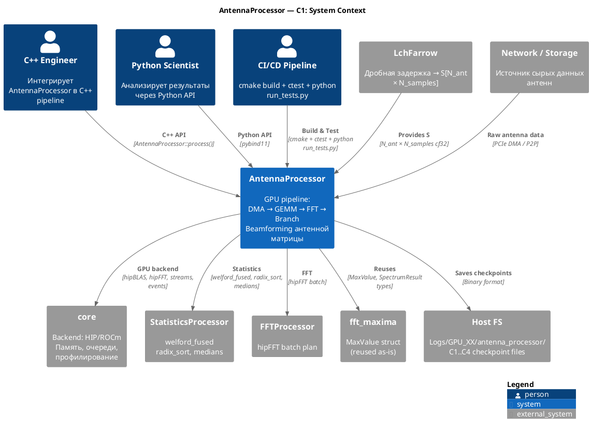

# C1 — System Context: AntennaProcessor Module
# DSP-GPU — Antenna Array Processor

> **Project**: DSP-GPU / AntennaProcessor
> **Date**: 2026-03-06
> **Reference**: [c4model.com](https://c4model.com)
> **Level**: 1 (System Context) — место модуля в системе

---

## 1. Описание

**AntennaProcessor** — модуль GPU-обработки антенной матрицы.
Принимает сырые данные антенн (после `LchFarrow`), применяет beamforming (GEMM),
статистику, Hamming-окно, FFT и поиск спектральных максимумов.

---

## 2. System Context Diagram

```
 ┌────────────────────────────────────────────────────────────────────────────────┐
 │                         ПОЛЬЗОВАТЕЛИ                                           │
 │                                                                                │
 │  ┌──────────────────┐   ┌──────────────────┐   ┌────────────────────────┐    │
 │  │   C++ Engineer   │   │  Python Scientist │   │  CI/CD / Test Suite    │    │
 │  │                  │   │                  │   │                        │    │
 │  │ Интегрирует      │   │ Анализирует      │   │ Прогоняет тесты:       │    │
 │  │ AntennaProcessor │   │ результаты в     │   │ C++ (all_test.hpp)     │    │
 │  │ в C++ пайплайн  │   │ Python/NumPy     │   │ Python (TestRunner)        │    │
 │  └────────┬─────────┘   └───────┬──────────┘   └──────────┬─────────────┘    │
 └───────────┼───────────────────── ┼──────────────────────────┼─────────────────┘
             │                      │                          │
             │ C++ API              │ Python API               │ cmake + ctest
             │ AntennaProcessor    │ (через pybind11)         │
             │                      │                          │
             ▼                      ▼                          ▼
 ┌──────────────────────────────────────────────────────────────────────────────┐
 │                                                                               │
 │         ╔═══════════════════════════════════════════════════════╗             │
 │         ║           AntennaProcessor Module                     ║             │
 │         ║                                                       ║             │
 │         ║  GPU Pipeline:                                        ║             │
 │         ║  S[N_ant × N_samples] → DMA → Stats → GEMM           ║             │
 │         ║    → Window + FFT → Step2.1/2.2/2.3 → Results        ║             │
 │         ║                                                       ║             │
 │         ║  Входы:  S (сигнал), W (веса beamforming)            ║             │
 │         ║  Выходы: MinMaxResult / MaxValue / AllMaximaResult    ║             │
 │         ║          StatisticsResult PRE/POST GEMM               ║             │
 │         ╚═════════════════════════╤═════════════════════════════╝             │
 │                                   │                                           │
 └───────────────────────────────────┼───────────────────────────────────────────┘
                                     │
         ┌───────────────────────────┼──────────────────────────────┐
         │                           │                              │
         ▼                           ▼                              ▼
┌─────────────────────┐  ┌──────────────────────────┐  ┌──────────────────────┐
│   GPU Hardware      │  │  Reused DSP-GPU Modules│  │  Host OS / FS        │
│                     │  │                            │  │                      │
│  AMD 9070 (RDNA4)  │  │  core              ←    │  │  Logs/GPU_XX/        │
│  AMD MI100 (CDNA)  │  │  StatisticsProcessor  ←    │  │  antenna_processor/  │
│  HIP streams:       │  │  FFTProcessor         ←    │  │  YYYY-MM-DD/         │
│  stream_dma         │  │  fft_maxima (MaxValue) ←   │  │  C1..C4_*.bin        │
│  stream_stats       │  │  hipBLAS (GEMM)        ←    │  │                      │
│  stream_main        │  │  hipFFT (batch FFT)    ←    │  │  Results/Profiler/   │
│  stream_spost       │  │                            │  │                      │
└─────────────────────┘  └──────────────────────────┘  └──────────────────────┘

                              ▲
                              │ Данные приходят через:
┌─────────────────────────────┴──────────────────────────────────────────────────┐
│  LchFarrow Module  →  S[N_ant × N_samples]   (данные выровнены по времени)    │
│  Network Card (NIC) →  через PCIe DMA или P2P DMA напрямую на GPU VRAM        │
└────────────────────────────────────────────────────────────────────────────────┘
```

---

## 3. Акторы и системы

### Пользователи (People)

| Актор | Роль | Взаимодействие |
|-------|------|----------------|
| **C++ Engineer** | Разработчик системы ЦОС | `AntennaProcessor::process(S, W)` → `AntennaResult` |
| **Python Scientist** | Анализ результатов | Python API (pybind11), numpy arrays |
| **CI/CD Pipeline** | Тестирование | `cmake --build` + ctest + python run_tests.py |

### Входные данные

| Данные | Размер | Источник |
|--------|--------|---------|
| **S** `[N_ant × N_samples]` cf32 | 2.5 ГБ (256×1.2M) или 70 МБ (3500×2500) | LchFarrow output / Network card |
| **W** `[N_ant × N_ant]` cf32 | 512 КБ (256×256, max) | Заранее вычислена (beamforming weights) |

### Выходные данные

| Результат | Ветка | Размер |
|-----------|-------|--------|
| `MaxValue[N_ant]` | Step2.1 OneMax+Parabola | 12 КБ |
| `AllMaximaBeamResult[N_ant]` | Step2.2 AllMaxima | ~2 МБ |
| `MinMaxResult[N_ant]` | Step2.3 GlobalMinMax | 8 КБ |
| `StatisticsResult[N_ant]` PRE+POST | Все | 28 КБ |

---

## 4. Границы модуля

```
               ┌─── Граница AntennaProcessor ──────────────────────────────────┐
               │                                                                │
  S, W ──────▶ │  Ответственность:                                             │
               │  ✅ DMA load (или работа с уже загруженными данными)           │
               │  ✅ Статистика PRE-GEMM по сырому сигналу                     │
               │  ✅ Beamforming GEMM: X = W × S (hipBLAS Cgemm)              │
               │  ✅ Статистика POST-GEMM по beamformed данным                  │
               │  ✅ Hamming window перед FFT                                   │
               │  ✅ FFT batch (hipFFT, N_ant лучей)                            │
               │  ✅ FFT mirror fold (отрицательные частоты → левая сторона)    │
               │  ✅ Step2.1: one MAX + 3-point parabola (sub-bin frequency)    │
               │  ✅ Step2.2: ALL peaks CFAR                                     │
               │  ✅ Step2.3: global MAX + MIN per beam                          │
               │  ✅ Checkpoint save C1-C4 (опционально, через ICheckpointSave) │
               │  ✅ GPU profiling (через core GPUProfiler)                   │
               │                                                                │
               │  Вне ответственности:                                          │
               │  ❌ Вычисление матрицы весов W (приходит готовой)              │
               │  ❌ Дробная задержка (LchFarrow — отдельный модуль)            │
               │  ❌ Управление GPU (core — внешний)                          │
               │  ❌ Визуализация результатов (Python side)                     │
               │  ❌ Сетевой приём данных                                       │
               └───────────────────────────────────────────────────────────────┘
               │
               ▼ AntennaResult
```

---

## 5. PlantUML



---

*Следующий уровень: [C2 — Container Diagram](AP_C2_Container.md)*
