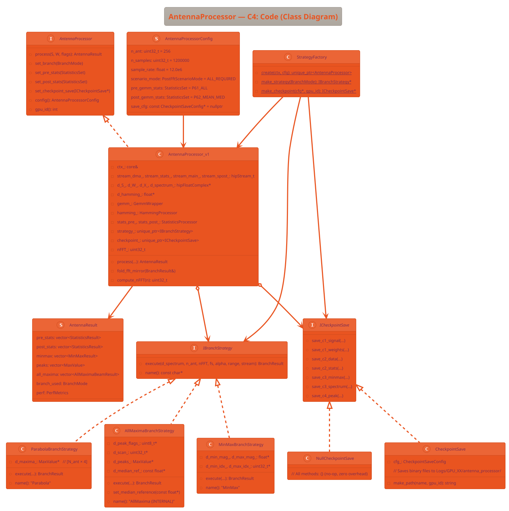

# C4 — Code Diagram: AntennaProcessor Module
# DSP-GPU — Antenna Array Processor

> **Project**: DSP-GPU / AntennaProcessor
> **Date**: 2026-03-06
> **Reference**: [c4model.com](https://c4model.com)
> **Level**: 4 (Code) — классы, интерфейсы, сигнатуры методов

> **Update 2026-03-07**: `Window + FFT` выделен как общий reusable блок. Итоговые post-FFT сценарии:
> - `Step2.1` → `OneMax + Parabola` (без фазы)
> - `Step2.2` → `AllMaxima`
> - `Step2.3` → `GlobalMinMax`

---

## 1. Enums и конфигурация

```cpp
// ── strategies/include/config/branch_mode.hpp ─────────────────

enum class PostFftScenarioMode : uint8_t {
    ALL_REQUIRED       = 0,  // считать все 3 post-FFT сценария
    ONE_MAX_PARABOLA   = 1,  // Step2.1
    ALL_MAXIMA         = 2,  // Step2.2
    GLOBAL_MINMAX      = 3   // Step2.3
};

// ── strategies/include/config/statistics_set.hpp ──────────────

// Флаги статистических полей (bitmask)
enum class StatField : uint32_t {
    NONE     = 0,
    MEAN     = 1 << 0,   // mean(Re), mean(Im), mean_magnitude
    MEDIAN   = 1 << 1,   // median of |z| (radix sort или P²)
    STD      = 1 << 2,   // std_dev of |z|
    VAR      = 1 << 3,   // variance of |z|
    MIN      = 1 << 4,   // min |z| + bin index
    MAX      = 1 << 5,   // max |z| + bin index
};

using StatisticsSet = uint32_t;  // комбинация через operator|

namespace StatPreset {
    constexpr StatisticsSet NONE         = 0;
    constexpr StatisticsSet P62_MEAN_MED = StatField::MEAN | StatField::MEDIAN;
    constexpr StatisticsSet P63_MED_MM   = StatField::MEAN | StatField::MEDIAN
                                         | StatField::MIN  | StatField::MAX;
    constexpr StatisticsSet P64_STD_VAR  = StatField::STD | StatField::VAR;
    constexpr StatisticsSet P61_ALL      = StatField::MEAN | StatField::MEDIAN
                                         | StatField::STD  | StatField::VAR
                                         | StatField::MIN  | StatField::MAX;
}
```

---

## 2. Конфигурационные структуры

```cpp
// ── strategies/include/config/antenna_processor_config.hpp ─────

struct CheckpointSaveConfig {
    // Флаги сохранения (всё false по умолчанию = нет оверхеда в production)
    bool   c1_signal     = false;  // Точка 4.1: сырой S[N_ant × N_samples] (2.5 ГБ!)
    bool   c1_weights    = false;  // Точка 4.1: матрица W[N_ant × N_ant] (512 КБ)
    bool   c2_data       = false;  // Точка 4.2: GEMM output X (2.5 ГБ!)
    bool   c2_stats      = false;  // Точка 4.2: stats PRE+POST GEMM (~28 КБ)
    bool   c3_result     = true;   // Точка 4.3: MinMaxResult (8 КБ) — дёшево!
    bool   c3_spectrum   = false;  // Точка 4.3: полный спектр (4.9 ГБ!) — только для теста
    bool   c4_result     = true;   // Точка 4.4: MaxValue (12 КБ) — дёшево!
    bool   json_header   = false;  // true = JSON+binary header (debug), false = pure binary
};

struct AntennaProcessorConfig {
    // ─── Размеры данных ──────────────────────────────────────────────────
    uint32_t     n_ant          = 5;
    uint32_t     n_samples      = 8000;
    float        sample_rate    = 12.0e6f;

    // ─── Алгоритм ────────────────────────────────────────────────────────
    PostFftScenarioMode scenario_mode = PostFftScenarioMode::ALL_REQUIRED;
    uint32_t    maxima_limit          = 1000;
    float       signal_frequency_hz   = 2.0e6f;

    // ─── Статистика ──────────────────────────────────────────────────────
    StatisticsSet pre_input_stats = StatPreset::P61_ALL;    // 2.1 по d_S
    StatisticsSet post_gemm_stats = StatPreset::P61_ALL;    // 2.2 по d_X
    StatisticsSet post_fft_stats  = StatPreset::P61_ALL;    // 2.3 по |spectrum|

    // ─── Checkpoint сохранение ───────────────────────────────────────────
    const CheckpointSaveConfig* save_cfg = nullptr;  // null = NullCheckpointSave (prod)
};
```

---

## 3. Результирующие структуры

```cpp
// ── strategies/include/result_types.hpp ───────────────────────

// Используется MaxValue из fft_maxima — ПЕРЕИСПОЛЬЗУЕМ КАК ЕСТЬ:
// #include "modules/fft_maxima/include/types/spectrum_result_types.hpp"
// struct MaxValue { ... }; // 32 байта, уже готова!

// MinMaxResult — для Step2.3 (один MIN + один MAX по спектру)
struct MinMaxResult {
    uint32_t beam_id;           // индекс луча [0..N_ant)
    // ── Минимум спектра ───────────────────────────────────────────────────
    float    min_magnitude;     // min |spectrum[k]| по всем бинам луча
    uint32_t min_bin;           // бин минимума [0..nFFT)
    float    min_frequency_hz;  // = min_bin * sample_rate / nFFT
    // ── Максимум спектра ──────────────────────────────────────────────────
    float    max_magnitude;     // max |spectrum[k]| по всем бинам луча
    uint32_t max_bin;           // бин максимума [0..nFFT)
    float    max_frequency_hz;  // = max_bin * sample_rate / nFFT
    // ── Производные ───────────────────────────────────────────────────────
    float    dynamic_range_dB;  // 20*log10(max_mag / max(min_mag, 1e-30f))
    uint32_t pad;               // 32-байтное выравнивание
};  // sizeof = 32 байта

// Итоговый результат process() — объединяет всё
struct AntennaResult {
    std::vector<StatisticsResult>  pre_input_stats;   // 2.1
    std::vector<StatisticsResult>  post_gemm_stats;   // 2.2
    std::vector<StatisticsResult>  post_fft_stats;    // 2.3 по |spectrum|

    std::vector<MinMaxResult>      minmax;       // Step2.3
    std::vector<MaxValue>          peaks;        // Step2.1 / совместимость API
    std::vector<AllMaximaBeamResult> all_maxima; // Step2.2

    PostFftScenarioMode scenario_mode;

    // ─── Метрики производительности ───────────────────────────────────────
    struct PerfMetrics {
        float dma_load_ms   = 0;
        float stats_pre_ms  = 0;
        float gemm_ms       = 0;
        float stats_post_ms = 0;
        float hamming_ms    = 0;
        float fft_ms        = 0;
        float branch_ms     = 0;
        float total_ms      = 0;
    } perf;
};
```

---

## 4. Интерфейсы

```cpp
// ── strategies/include/interfaces/i_post_fft_scenario.hpp ────────

class IPostFftScenario {
public:
    virtual ~IPostFftScenario() = default;

    // Основной метод: обработка спектра
    // d_spectrum: [N_ant × nFFT] cf32, на GPU (HIP)
    // params: параметры из AntennaProcessorConfig
    virtual ScenarioResult execute(
        const hipFloatComplex* d_spectrum,
        uint32_t n_ant,
        uint32_t nFFT,
        float    sample_rate,
        uint32_t maxima_limit,
        hipStream_t stream
    ) = 0;

    virtual const char* name() const = 0;  // "OneMaxParabola", "AllMaxima", "GlobalMinMax"
};

// ── strategies/include/interfaces/i_checkpoint_save.hpp ─────────

class ICheckpointSave {
public:
    virtual ~ICheckpointSave() = default;

    // C1: после DMA load
    virtual void save_c1_signal(
        const hipFloatComplex* d_data,    // GPU pointer
        uint32_t n_ant, uint32_t n_samples,
        float sample_rate, int gpu_id
    ) = 0;

    virtual void save_c1_weights(
        const hipFloatComplex* d_weights,  // W[N_ant × N_ant], GPU pointer
        uint32_t n_ant, int gpu_id
    ) = 0;

    // C2: после GEMM / debug point 2.2
    virtual void save_c2_data(
        const hipFloatComplex* d_X,       // GPU pointer
        uint32_t n_ant, uint32_t n_samples,
        float sample_rate, int gpu_id
    ) = 0;

    virtual void save_c2_stats(
        const StatisticsResult* pre_stats,  // CPU (уже скопировано с GPU)
        const StatisticsResult* post_stats,
        uint32_t n_ant, int gpu_id
    ) = 0;

    // C3: после FFT / debug point 2.3
    virtual void save_c3_minmax(
        const MinMaxResult* results,   // CPU
        uint32_t n_ant, int gpu_id
    ) = 0;

    virtual void save_c3_spectrum(
        const hipFloatComplex* d_spectrum,  // GPU pointer
        uint32_t n_ant, uint32_t nFFT, int gpu_id
    ) = 0;

    // C4: результаты post-FFT scenarios
    virtual void save_c4_peak(
        const MaxValue* results,       // CPU
        uint32_t n_ant, int gpu_id
    ) = 0;
};

// ── strategies/include/interfaces/antenna_processor.hpp ──────

class AntennaProcessor {
public:
    virtual ~AntennaProcessor() = default;

    // ─── Основной метод ───────────────────────────────────────────────────
    // S: входной сигнал [N_ant × N_samples], может быть:
    //    (a) CPU-указатель → будет скопирован через DMA
    //    (b) GPU-указатель (если флаг s_on_gpu=true) → без копирования
    virtual AntennaResult process(
        const hipFloatComplex* S,
        const hipFloatComplex* W,          // матрица весов [N_ant × N_ant]
        bool s_on_gpu    = false,          // S уже на GPU?
        bool w_on_gpu    = false           // W уже на GPU?
    ) = 0;

    // ─── Конфигурация (может меняться между вызовами) ─────────────────────
    virtual void set_scenario_mode(PostFftScenarioMode mode) = 0;
    virtual void set_pre_input_stats(StatisticsSet stats) = 0;
    virtual void set_post_gemm_stats(StatisticsSet stats) = 0;
    virtual void set_post_fft_stats(StatisticsSet stats) = 0;
    virtual void set_checkpoint_save(ICheckpointSave* save) = 0;  // nullptr = Null Object

    // ─── Информация ───────────────────────────────────────────────────────
    virtual const AntennaProcessorConfig& config() const = 0;
    virtual int  gpu_id() const = 0;
};
```

---

## 5. Главный класс

```cpp
// ── strategies/include/antenna_processor_v1.hpp ─────────────

class AntennaProcessor_v1 final : public AntennaProcessor {
public:
    // ─── Конструктор ──────────────────────────────────────────────────────
    explicit AntennaProcessor_v1(
        core&                      ctx,
        const AntennaProcessorConfig& cfg,
        IBranchStrategy*             strategy,   // владение: unique_ptr
        ICheckpointSave*             checkpoint  // владение: unique_ptr
    );

    ~AntennaProcessor_v1() override;

    // ─── AntennaProcessor implementation ─────────────────────────────────
    AntennaResult process(
        const hipFloatComplex* S,
        const hipFloatComplex* W,
        bool s_on_gpu = false,
        bool w_on_gpu = false
    ) override;

    void set_branch(BranchMode mode) override;
    void set_pre_stats(StatisticsSet stats) override;
    void set_post_stats(StatisticsSet stats) override;
    void set_checkpoint_save(ICheckpointSave* save) override;

    const AntennaProcessorConfig& config() const override { return cfg_; }
    int  gpu_id() const override;

private:
    // ─── GPU ресурсы ──────────────────────────────────────────────────────
    core&        ctx_;
    hipStream_t    stream_dma_;    // Stream 0: DMA Host→GPU
    hipStream_t    stream_stats_;  // Stream 1: Statistics PRE-GEMM
    hipStream_t    stream_main_;   // Stream 2: GEMM + Hamming + FFT
    hipStream_t    stream_spost_;  // Stream 3: Statistics POST-GEMM

    hipEvent_t     event_data_ready_;   // DMA → запускает Streams 1,2
    hipEvent_t     event_gemm_done_;    // GEMM → запускает Stream 3
    hipEvent_t     event_stats_done_;   // Stats PRE → CPU read
    hipEvent_t     event_spost_done_;   // Stats POST → CPU read
    hipEvent_t     event_fft_done_;     // FFT → запускает branch

    // ─── GPU буферы (VRAM) ────────────────────────────────────────────────
    hipFloatComplex* d_S_ = nullptr;       // [N_ant × N_samples]  сырые данные
    hipFloatComplex* d_W_ = nullptr;       // [N_ant × N_ant]      матрица весов
    hipFloatComplex* d_X_ = nullptr;       // [N_ant × N_samples]  GEMM output
    hipFloatComplex* d_spectrum_ = nullptr;// [N_ant × nFFT]       FFT output
    float*           d_hamming_ = nullptr; // [N_samples]          окно Хемминга

    // ─── Компоненты ───────────────────────────────────────────────────────
    GemmWrapper                         gemm_;
    HammingProcessor                    hamming_;
    hipfftHandle                        fft_plan_{};  // hipFFT batch plan
    StatisticsProcessor                 stats_pre_;   // PRE-GEMM stats (по S)
    StatisticsProcessor                 stats_post_;  // POST-GEMM stats (по X)
    std::unique_ptr<IBranchStrategy>    strategy_;
    std::unique_ptr<ICheckpointSave>    checkpoint_;

    // ─── Конфигурация ─────────────────────────────────────────────────────
    AntennaProcessorConfig cfg_;
    uint32_t               nFFT_ = 0;   // = next_pow2(N_samples) для zero-padding

    // ─── Внутренние методы ────────────────────────────────────────────────
    void   allocate_buffers();
    void   reallocate_if_needed(uint32_t n_ant, uint32_t n_samples);
    void   init_fft_plan();
    void   fold_fft_mirror(BranchResult& result);  // Note #2: fold k>nFFT/2
    uint32_t compute_nFFT(uint32_t n_samples);     // = 2^(floor(log2(N))+1)
};
```

---

## 6. Стратегии (Step2.1, Step2.2, Step2.3)

```cpp
// ── strategies/include/strategies/minmax_branch_strategy.hpp ───

class MinMaxBranchStrategy final : public IBranchStrategy {
public:
    BranchResult execute(
        const hipFloatComplex* d_spectrum,
        uint32_t n_ant, uint32_t nFFT,
        float sample_rate, float cfar_alpha,
        uint32_t search_range, hipStream_t stream
    ) override;

    const char* name() const override { return "MinMax"; }

private:
    // GPU буферы результата (аллоцируются при первом вызове)
    float*    d_min_mag_ = nullptr;   // [N_ant]
    uint32_t* d_min_idx_ = nullptr;   // [N_ant]
    float*    d_max_mag_ = nullptr;   // [N_ant]
    uint32_t* d_max_idx_ = nullptr;   // [N_ant]

    // HIP kernel: minmax_spectrum.hip
    // Grid:  dim3(N_ant)    — один блок на луч
    // Block: dim3(256)      — 256 потоков на блок
    // Shared: 4 × 256 × 4 = 4 КБ на блок (tree reduction)
};

// ── strategies/include/strategies/parabola_branch_strategy.hpp ─

class ParabolaBranchStrategy final : public IBranchStrategy {
public:
    BranchResult execute(
        const hipFloatComplex* d_spectrum,
        uint32_t n_ant, uint32_t nFFT,
        float sample_rate, float cfar_alpha,
        uint32_t search_range, hipStream_t stream
    ) override;

    const char* name() const override { return "Parabola"; }

private:
    // Переиспользуем логику из SpectrumMaximaFinder (fft_maxima модуль)
    // d_maxima_: [N_ant × 4] MaxValue (interpolated + left + center + right)
    MaxValue* d_maxima_ = nullptr;

    // HIP kernel: post_kernel_one_peak (адаптирован из fft_maxima)
    // Grid:  dim3(N_ant)   — один блок на луч
    // Block: dim3(256)     — tree reduction для global max
    // Затем в thread 0: паrabola 3-point interpolation
};

// ── strategies/include/strategies/all_maxima_branch_strategy.hpp

class AllMaximaBranchStrategy final : public IBranchStrategy {
public:
    // ТОЛЬКО ДЛЯ ВНУТРЕННЕГО ТЕСТИРОВАНИЯ!
    // Использует CFAR: threshold = median * cfar_alpha (median из pre_stats)
    BranchResult execute(
        const hipFloatComplex* d_spectrum,
        uint32_t n_ant, uint32_t nFFT,
        float sample_rate, float cfar_alpha,
        uint32_t search_range, hipStream_t stream
    ) override;

    const char* name() const override { return "AllMaxima (INTERNAL)"; }

    // Передаём медиану из PRE или POST статистики (нужна для CFAR)
    void set_median_reference(const float* d_median_per_beam);

private:
    uint8_t*  d_peak_flags_ = nullptr;  // [N_ant × nFFT] — маски пиков
    uint32_t* d_scan_ = nullptr;         // [N_ant × nFFT] — prefix sum
    MaxValue* d_peaks_ = nullptr;        // [N_ant × MAX_PEAKS] — найденные пики
    uint32_t* d_n_peaks_ = nullptr;      // [N_ant]

    static constexpr uint32_t kMaxPeaksPerBeam = 256;
    const float* d_median_ref_ = nullptr;  // ← медиана для CFAR (не владеем)
};
```

---

## 7. GemmWrapper

```cpp
// ── strategies/kernels/gemm_wrapper.hpp ───────────────────────

class GemmWrapper {
public:
    GemmWrapper() = default;
    ~GemmWrapper();

    // X[N_ant × N_samples] = W[N_ant × N_ant] × S[N_ant × N_samples]
    // hipBLAS column-major: Cgemm(OP_N, OP_N, N_ant, N_samples, N_ant, ...)
    void compute(
        hipblasHandle_t       handle,
        const hipFloatComplex* W,    // [N_ant × N_ant]   GPU pointer
        const hipFloatComplex* S,    // [N_ant × N_samples] GPU pointer
        hipFloatComplex*       X,    // [N_ant × N_samples] GPU pointer (output)
        uint32_t n_ant,
        uint32_t n_samples,
        hipStream_t stream
    );

    // Arithmetic Intensity = 8 × N_ant × N_samples × N_ant / (5 × N_ant × N_samples)
    // = 8 × N_ant / 5 ≈ 410 FLOPs/byte для N_ant=256 → compute-bound!
    // Time ≈ 2 × N_ant² × N_samples × 8 FLOPs / 48 TFLOPS ≈ 13 мс (для 256×1.2M)

private:
    hipblasHandle_t handle_ = nullptr;
    bool owns_handle_ = false;  // если handle создан внутри, мы его уничтожаем
};
```

---

## 8. Factory Method

```cpp
// ── strategies/include/strategy_factory.hpp ───────────

class StrategyFactory {
public:
    // Создаёт AntennaProcessor_v1 с нужной Strategy и CheckpointSave
    static std::unique_ptr<AntennaProcessor> create(
        core&                       ctx,
        const AntennaProcessorConfig& cfg
    );

    // Пример использования:
    //   AntennaProcessorConfig cfg;
    //   cfg.scenario_mode = PostFftScenarioMode::ONE_MAX_PARABOLA;
    //   cfg.pre_gemm_stats = StatPreset::P61_ALL;
    //
    //   auto proc = StrategyFactory::create(ctx, cfg);
    //   AntennaResult r = proc->process(S_data, W_data);
    //
    // В production: cfg.save_cfg = nullptr → NullCheckpointSave (zero overhead)
    // В debug:
    //   CheckpointSaveConfig save;
    //   save.c4_result = true;
    //   cfg.save_cfg = &save;
    //   auto proc = StrategyFactory::create(ctx, cfg);

private:
    static IBranchStrategy*  make_strategy(BranchMode mode);
    static ICheckpointSave*  make_checkpoint(const CheckpointSaveConfig* cfg, int gpu_id);
};
```

---

## 9. PlantUML: Class Diagram



---

*Создано: 2026-03-06*
*Предыдущий уровень: [C3 — Component Diagram](AP_C3_Component.md)*
