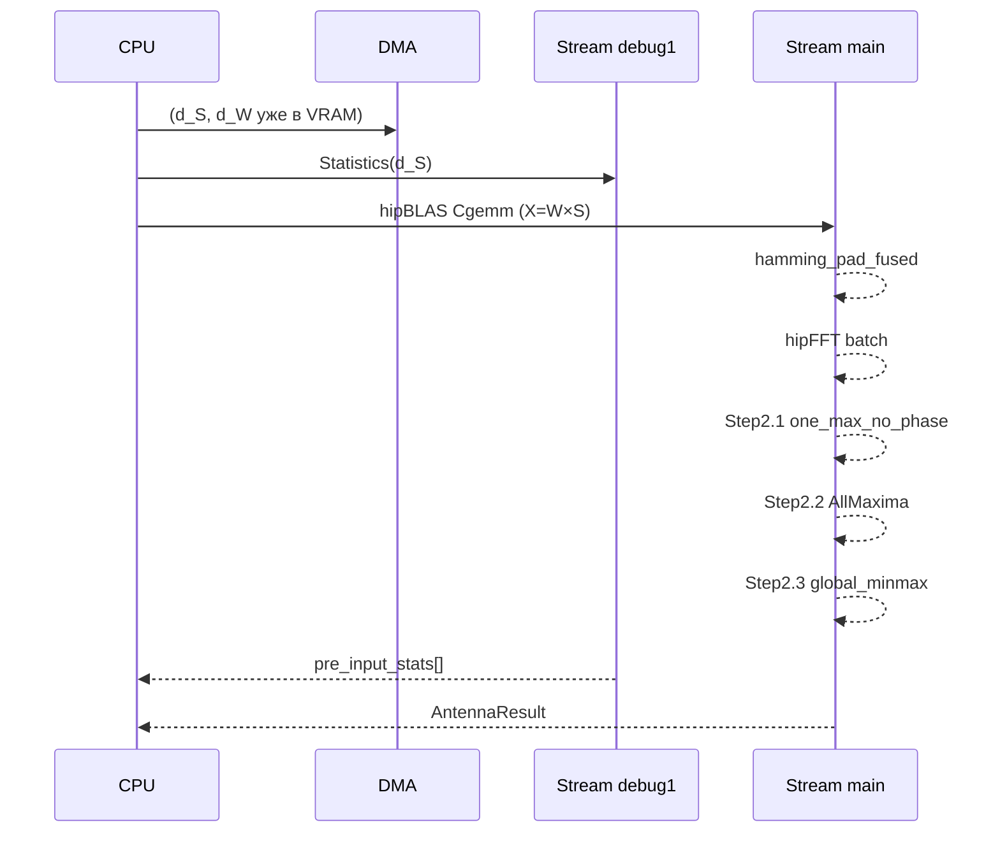

# strategies — Полная документация

> GPU-pipeline обработки антенной матрицы: GEMM + Hamming + FFT + анализ спектра

**Namespace**: `strategies`
**Каталог**: `strategies/`
**Зависимости**: core (`IBackend*`), statistics (`StatisticsProcessor`), fft_maxima (`AllMaximaPipelineROCm`), hipBLAS, hipFFT, hiprtc
**Платформа**: ROCm 7.2+ / AMD GPU (`ENABLE_ROCM=1`). Без ROCm — стаб, бросает исключение.

---

## Содержание

1. [Обзор и назначение](#1-обзор-и-назначение)
2. [Математика алгоритма](#2-математика-алгоритма)
3. [Пошаговый pipeline](#3-пошаговый-pipeline)
4. [Архитектура классов](#4-архитектура-классов)
5. [HIP Kernels](#5-hip-kernels)
6. [C4 Диаграммы](#6-c4-диаграммы)
7. [API (C++ и Python)](#7-api)
8. [Файловая структура](#8-файловая-структура)
9. [Тесты](#9-тесты)
10. [Бенчмарки и тайминги](#10-бенчмарки)
11. [Конфигурация](#11-конфигурация)
12. [Checkpoint](#12-checkpoint)
13. [VRAM Layout](#13-vram-layout)
14. [Ссылки](#14-ссылки)

---

## 1. Обзор и назначение

**AntennaProcessor** — GPU-модуль цифрового формирования луча (Digital Beamforming, DBF).

Принимает:
- `d_S` — сигнал `complex<float>[n_ant × n_samples]`, уже в VRAM
- `d_W` — весовая матрица `complex<float>[n_ant × n_ant]`, уже в VRAM

Выполняет:
1. Статистику сигнала (параллельно с GEMM)
2. GEMM: `X = W × S` — формирование луча (hipBLAS, ~13 мс)
3. Статистику после GEMM
4. Окно Хемминга + нулевое дополнение (fused kernel)
5. Батчевое FFT (hipFFT, ~20 мс)
6. Три post-FFT сценария:
   - **Step2.1**: один главный пик + уточнение параболой
   - **Step2.2**: все локальные пики (до 1000)
   - **Step2.3**: глобальный MIN+MAX + dynamic range, дБ
7. Возвращает `AntennaResult` (статистика + пики + тайминги)

**Итоговое время из VRAM**: ~35 мс (256 антенн × 1.2M отсчётов, AMD RX 9070)

---

## 2. Математика алгоритма

### 2.1 Delay-and-Sum весовая матрица

Для каждой антенны $k$ и луча $b$:

$$
W[b, k] = \frac{1}{\sqrt{N_{ant}}} \exp\!\left(-j \cdot 2\pi \cdot f_0 \cdot \tau_k\right)
$$

где $\tau_k = \tau_{base} + k \cdot \tau_{step}$ — задержка $k$-й антенны (секунды).

Реализовано в `WeightGenerator::generate_delay_and_sum()` (CPU-side, NumPy-совместимо).

### 2.2 GEMM — формирование луча

$$
X = W \cdot S \quad \in \mathbb{C}^{n_{ant} \times n_{samples}}
$$

$W \in \mathbb{C}^{n_{ant} \times n_{ant}}$, $S \in \mathbb{C}^{n_{ant} \times n_{samples}}$.

Вызов: `hipblasCgemm(handle, HIPBLAS_OP_N, HIPBLAS_OP_N, ...)`.

### 2.3 Окно Хемминга + zero-padding

$$
x'_{b}[n] = \begin{cases} w[n] \cdot X[b,n] & 0 \le n < N_{samples} \\ 0 & N_{samples} \le n < N_{FFT} \end{cases}
$$

$$
w[n] = 0.54 - 0.46 \cos\!\left(\frac{2\pi n}{N_{samples} - 1}\right)
$$

Окно предвычислено один раз при конструкции, хранится в `d_hamming_window` (VRAM). Реализовано fused kernel `hamming_pad_fused`.

### 2.4 Батчевое FFT

$$
\text{spectrum}[b, k] = \sum_{n=0}^{N_{FFT}-1} x'_b[n] \cdot e^{-j2\pi kn/N_{FFT}}
$$

Выполняется `hipfftExecC2C` на все $n_{ant}$ лучей одним планом (batch).

### 2.5 Step2.1 — Один максимум + параболическая интерполяция

$$
k^* = \arg\max_k |\text{spectrum}[b, k]|
$$

Уточнение через 3-point parabola (без фазы):

$$
\delta = \frac{|\text{sp}[k^*-1]| - |\text{sp}[k^*+1]|}{2\left(|\text{sp}[k^*-1]| + |\text{sp}[k^*+1]| - 2|\text{sp}[k^*]|\right)}
$$

$$
f_{refined} = (k^* + \delta) \cdot \frac{f_s}{N_{FFT}}
$$

### 2.6 Step2.3 — Dynamic Range

$$
\text{dynamic\_range\_dB} = 20 \log_{10}\!\left(\frac{M_{max}}{\max(M_{min}, 10^{-30})}\right)
$$

---

## 3. Пошаговый pipeline

### ASCII-диаграмма

```
[VRAM] d_S[n_ant × n_samples]   d_W[n_ant × n_ant]
            │                         │
            ├──── event_data_ready ───┤
            │                         │
 ┌──────────┴──────────┐   ┌──────────┴──────────────────────────────────┐
 │  Stream debug1      │   │  Stream main                                 │
 │  Statistics(d_S)    │   │  hipBLAS Cgemm (X = W×S) ≈13мс              │
 │  → pre_stats[]      │   │  ├── event_gemm_done                         │
 └──────────┬──────────┘   │  hamming_pad_fused + hipFFT ≈20мс           │
            │              │  ├── event_fft_done                          │
            │              │  │                                           │
            │              │  ├─ Step2.1: one_max_no_phase   <1мс         │
            │              │  ├─ Step2.2: AllMaxima          2-5мс        │
            │              │  └─ Step2.3: global_minmax      <1мс         │
            │              └──────────────┬──────────────────────────────┘
            │                             │
            ▼                             ▼
       pre_input_stats            { one_max[], all_maxima[], minmax[], perf }
```

### Mermaid



---

## 4. Архитектура классов

### Иерархия

```
strategies::AntennaProcessor          ← abstract base (antenna_processor.hpp)
└── strategies::AntennaProcessor_v1   ← ROCm impl (antenna_processor_v1.hpp)
    └── strategies::AntennaProcessorTest  ← step-by-step (antenna_processor_test.hpp)

strategies::IPostFftScenario          ← interface (i_post_fft_scenario.hpp)
  (реализации встроены в AntennaProcessor_v1, не вынесены в отдельные файлы)

strategies::ICheckpointSave           ← interface (i_checkpoint_save.hpp)
└── strategies::NullCheckpointSave    ← no-op (null_checkpoint_save.hpp)

strategies::WeightGenerator           ← static class (weight_generator.hpp)
```

### GoF паттерны

| Паттерн | Реализация | Зачем |
|---------|-----------|-------|
| **Strategy** | `IPostFftScenario` + `PostFftScenarioMode` enum | Переключение ветки без перекомпиляции |
| **Null Object** | `NullCheckpointSave` | Production: zero overhead, нет ветвления |
| **Template Method** | `AntennaProcessor_v1::process()` | Фиксированный порядок шагов |
| **Тестовый Proxy** | `AntennaProcessorTest` | Открывает protected методы для тестов |

### AntennaProcessor_v1 — внутренние ресурсы

```
hipStream_t  stream_main_    // GEMM + Window + FFT + post-FFT
hipStream_t  stream_debug1_  // Statistics(d_S)
hipStream_t  stream_debug2_  // Statistics(d_X)  [если нужно]
hipStream_t  stream_debug3_  // Statistics(|spectrum|) + post-FFT

hipblasHandle_t  blas_handle_
hipfftHandle_t   fft_plan_     // batch plan для n_ant лучей

void*  d_X                    // GEMM output [n_ant × n_samples]
void*  d_spectrum             // FFT output  [n_ant × n_fft]
void*  d_magnitudes           // |FFT| per beam
void*  d_hamming_window       // precomputed Hamming [n_samples]
void*  d_one_max_results      // Step2.1 raw results
void*  d_minmax_results       // Step2.3 raw results
```

---

## 5. HIP Kernels

Все kernels хранятся в `include/kernels/strategies_kernels_rocm.hpp` как raw string для **hiprtc compilation** (JIT). Кеширование через `KernelCacheService` (P1+P2).

### hamming_pad_fused

**Назначение**: применить окно Хемминга и zero-pad одновременно.
**Почему fused**: две отдельные операции → два прохода по памяти (BW-bound). Слияние = один проход.

```cpp
__launch_bounds__(256)
__global__ void hamming_pad_fused(
    hipFloatComplex* __restrict__ d_out,        // d_spectrum (перед FFT)
    const hipFloatComplex* __restrict__ d_in,   // d_X после GEMM
    const float* __restrict__ d_window,         // precomputed Hamming
    uint32_t n_samples, uint32_t nFFT)
// Grid: (nFFT, n_ant) — blockIdx.y = beam_id (P6: no div/mod)
```

Оптимизации: P6 (2D grid), P10 (precomputed window), P13 (fused).

### compute_magnitudes

**Назначение**: `d_magnitudes[i] = |d_spectrum[i]|` через быстрый intrinsic.

```cpp
__launch_bounds__(256)
__global__ void compute_magnitudes(float* d_out, const hipFloatComplex* d_in, uint32_t size)
```

Оптимизации: P9 (`__fsqrt_rn`).

### global_minmax

**Назначение**: per-beam MIN+MAX с warp shuffle reduction.

```cpp
__launch_bounds__(256)
__global__ void global_minmax(
    MinMaxResult_t* d_results,
    const float* d_magnitudes,
    uint32_t nFFT, float fs)
// Grid: (blocks_per_beam, n_ant), LDS: float[256+1] padding (P8)
```

Оптимизации: P6, P7 (warp shuffle), P8 (LDS +1 padding против bank conflicts).

### one_max_no_phase

**Назначение**: per-beam one MAX + 3-point parabola (без фазы — P9: нет atan2).

```cpp
__launch_bounds__(256)
__global__ void one_max_no_phase(
    OneMaxResult_t* d_results,
    const float* d_magnitudes,
    uint32_t nFFT, float fs)
```

Оптимизации: P6, P7, P8, P9.

---

## 6. C4 Диаграммы

Детальные C4 документы находятся в той же директории:

| Уровень | Документ | Содержание |
|---------|----------|-----------|
| C1 System Context | [AP_C1_SystemContext.md](AP_C1_SystemContext.md) | Акторы, внешние системы, PlantUML |
| C2 Container | [AP_C2_Container.md](AP_C2_Container.md) | GPU streams, HIP events, VRAM схема |
| C3 Component | [AP_C3_Component.md](AP_C3_Component.md) | SOLID, GRASP, GoF, файловая структура |
| C4 Code | [AP_C4_Code.md](AP_C4_Code.md) | Все интерфейсы и сигнатуры |
| Sequences | [AP_Seq.md](AP_Seq.md) | Pipeline timing, FFT fold, chunking |
| Checkpoint Detail | [checkpoint_C1_C4_reports.md](checkpoint_C1_C4_reports.md) | Checkpoint C1-C4 детали |

### C1 — System Context (упрощённый)

```
┌─────────────────────────────────────────────┐
│              DSP-GPU System              │
│                                             │
│  ┌────────────────────────────────────────┐ │
│  │         strategies module              │ │
│  │                                        │ │
│  │  AntennaProcessor_v1                   │ │
│  │   ├── hipBLAS (GEMM)                   │ │
│  │   ├── hipFFT (FFT batch)               │ │
│  │   ├── hiprtc (JIT kernels)             │ │
│  │   ├── statistics (welford/radix)       │ │
│  │   └── fft_maxima (AllMaxima)           │ │
│  └────────────────────────────────────────┘ │
└─────────────────────────────────────────────┘
     ▲                    ▲
  [d_S, d_W]        [AntennaResult]
  (VRAM input)       (CPU output)
```

---

## 7. API

### 7.1 C++ API

#### AntennaProcessor (abstract)

```cpp
namespace strategies {

class AntennaProcessor {
public:
  virtual ~AntennaProcessor() = default;

  // Основной вызов — d_S и d_W уже на GPU
  virtual AntennaResult process(const void* d_S, const void* d_W) = 0;

  // Runtime конфигурация
  virtual void set_scenario_mode(PostFftScenarioMode mode) = 0;
  virtual void set_pre_input_stats(StatisticsSet stats) = 0;
  virtual void set_post_gemm_stats(StatisticsSet stats) = 0;
  virtual void set_post_fft_stats(StatisticsSet stats) = 0;
  virtual void set_debug_mode(bool enabled) = 0;

  // Информация
  virtual const AntennaProcessorConfig& config() const = 0;
  virtual int gpu_id() const = 0;
};

}
```

#### AntennaProcessor_v1 (concrete)

```cpp
namespace strategies {

class AntennaProcessor_v1 : public AntennaProcessor {
public:
  AntennaProcessor_v1(drv_gpu_lib::IBackend* backend,
                      const AntennaProcessorConfig& cfg);
  ~AntennaProcessor_v1();

  AntennaResult process(const void* d_S, const void* d_W) override;
  // ... реализация всех virtual методов

protected:
  // Открыты для AntennaProcessorTest
  void do_gemm();
  void do_window_fft();
  void do_debug_point_21();  // Stats(d_S)
  void do_debug_point_22();  // Stats(d_X)
  void do_debug_point_23();  // Stats(|spectrum|)
  void do_run_post_fft_scenarios();
};

}
```

#### AntennaProcessorTest (test-only)

```cpp
namespace strategies {

class AntennaProcessorTest : public AntennaProcessor_v1 {
public:
  AntennaProcessorTest(drv_gpu_lib::IBackend* backend,
                       const AntennaProcessorConfig& cfg);

  // Пошаговый API (порядок важен!)
  void step_0_prepare_input(const void* d_S, const void* d_W);
  void step_1_debug_input();       // D2H stats on d_S → CPU
  void step_2_gemm();              // X = W×S + D2H result
  void step_3_debug_post_gemm();   // D2H stats on d_X
  void step_4_window_fft();        // Hamming + FFT + D2H spectrum
  void step_5_debug_post_fft();    // D2H stats on |spectrum|
  void step_6_1_one_max();         // Step2.1 only
  void step_6_2_all_maxima();      // Step2.2 only
  void step_6_3_global_minmax();   // Step2.3 only
  AntennaResult process_full();    // Весь pipeline
};

}
```

#### WeightGenerator

```cpp
namespace strategies {

struct WeightParams {
  uint32_t n_ant    = 5;
  double   f0       = 2.0e6;   // Hz
  double   tau_base = 0.0;     // seconds
  double   tau_step = 100e-6;  // seconds per antenna
};

class WeightGenerator {
public:
  // CPU: W[beam][ant] = exp(-j*2π*f0*tau[ant]) / sqrt(n_ant)
  static std::vector<std::complex<float>>
      generate_delay_and_sum(const WeightParams& params);

  // GPU: выделить VRAM + MemcpyH2D. Caller owns!
  static void* upload_to_gpu(drv_gpu_lib::IBackend* backend,
                              const std::vector<std::complex<float>>& weights);
};

}
```

#### Структуры результатов

```cpp
namespace strategies {

struct OneMaxParabolaLite {
  uint32_t beam_id;
  uint32_t bin_index;       // FFT bin пика
  float    magnitude;       // |FFT[bin]|
  float    freq_offset;     // delta [-0.5, +0.5]
  float    refined_freq_hz; // (bin + delta) * fs / nFFT
};

struct MinMaxResult {
  uint32_t beam_id;
  float    min_magnitude;  float min_frequency_hz;  uint32_t min_bin;
  float    max_magnitude;  float max_frequency_hz;  uint32_t max_bin;
  float    dynamic_range_dB;  // 20*log10(max/max(min, 1e-30))
};

struct PerfMetrics {
  float debug_21_ms;  float gemm_ms;    float debug_22_ms;
  float window_ms;    float fft_ms;     float debug_23_ms;
  float step21_ms;    float step22_ms;  float step23_ms;
  float total_ms;
};

struct AntennaResult {
  std::vector<statistics::StatisticsResult> pre_input_stats;
  std::vector<statistics::StatisticsResult> post_gemm_stats;
  std::vector<statistics::StatisticsResult> post_fft_stats;
  std::vector<statistics::MedianResult>     pre_input_medians;
  std::vector<statistics::MedianResult>     post_gemm_medians;
  std::vector<statistics::MedianResult>     post_fft_medians;

  std::vector<OneMaxParabolaLite>               one_max;     // Step2.1
  std::vector<antenna_fft::AllMaximaBeamResult> all_maxima;  // Step2.2
  std::vector<MinMaxResult>                     minmax;      // Step2.3

  PostFftScenarioMode scenario_mode;
  PerfMetrics perf;
};

}
```

### 7.2 Python API

Python bindings через `py_modules/` (если добавлены). Сейчас основной Python-интерфейс — через `Python_test/strategies/pipeline_runner.py`:

#### PipelineRunner

```python
from Python_test.strategies.pipeline_runner import (
    PipelineRunner, PipelineConfig, PipelineResult
)
from Python_test.strategies.scenario_builder import (
    ScenarioBuilder, make_single_target, make_multi_target
)
from Python_test.strategies.farrow_delay import FarrowDelay

# Построение сценария
scenario = make_single_target(n_ant=8, theta_deg=30,
                              f0_hz=2e6, fdev_hz=0,
                              snr_db=20)

# Запуск PipelineA (фазовая коррекция)
runner = PipelineRunner(output_dir="Results/strategies/test_01")
cfg    = PipelineConfig(save_input=True, save_spectrum=True,
                        save_stats=True, save_results=True)
result_a = runner.run_pipeline_a(scenario, steer_theta=30,
                                 steer_freq=2e6, config=cfg)

# Запуск PipelineB (Farrow delay alignment)
result_b = runner.run_pipeline_b(scenario, steer_theta=30, config=cfg)

# Сравнение
comp = runner.compare(result_a, result_b)

# Доступ к результатам
peaks     = result_a.peaks        # List[PeakInfo]
stats     = result_a.stats        # List[ChannelStats]
spectrum  = result_a.spectrum     # np.ndarray [n_ant, nFFT]
```

#### ScenarioBuilder

```python
from Python_test.strategies.scenario_builder import ScenarioBuilder, EmitterSignal

scenario = (ScenarioBuilder(n_ant=8, d_ant_m=0.075, c=3e8)
    .add_target(theta_deg=30, f0_hz=2e6, amplitude=1.0)
    .add_jammer(theta_deg=60, f0_hz=3e6, amplitude=0.5)
    .set_noise(snr_db=20)
    .build())

# Доступ
delays = scenario.geometry.compute_delays(30)  # seconds per antenna
signal = scenario.signal_matrix               # [n_ant, n_samples]
```

#### FarrowDelay

```python
from Python_test.strategies.farrow_delay import FarrowDelay

farrow = FarrowDelay()

# Применить задержку к одной антенне
delayed = farrow.apply_single(signal_1d, delay_samples=2.7)

# Применить задержки к матрице антенн (в секундах)
delayed_matrix = farrow.apply_seconds(signal_matrix,
                                      delays_sec=[0, 1e-6, 2e-6],
                                      fs=12e6)

# Компенсировать задержку
compensated = farrow.compensate_seconds(delayed_matrix,
                                        delays_sec=[0, 1e-6, 2e-6],
                                        fs=12e6)
```

---

## 8. Файловая структура

```
strategies/
├── CMakeLists.txt
├── include/
│   ├── antenna_processor.hpp          # AntennaProcessor (abstract)
│   ├── antenna_processor_v1.hpp       # AntennaProcessor_v1 (ROCm impl)
│   ├── antenna_processor_test.hpp     # AntennaProcessorTest (step-by-step)
│   ├── weight_generator.hpp           # WeightGenerator (static)
│   ├── result_types.hpp               # AntennaResult, OneMaxParabolaLite, MinMaxResult, PerfMetrics
│   ├── kernels/
│   │   └── strategies_kernels_rocm.hpp  # HIP kernels (hiprtc raw string)
│   ├── interfaces/
│   │   ├── i_checkpoint_save.hpp      # ICheckpointSave interface
│   │   └── i_post_fft_scenario.hpp    # IPostFftScenario interface
│   ├── checkpoint/
│   │   └── null_checkpoint_save.hpp   # NullCheckpointSave (Null Object)
│   └── config/
│       ├── antenna_processor_config.hpp  # AntennaProcessorConfig + CheckpointSaveConfig
│       ├── post_fft_scenario_mode.hpp    # PostFftScenarioMode enum
│       └── statistics_set.hpp            # StatisticsSet bitmask + StatPreset
├── src/
│   ├── antenna_processor_v1.cpp       # Реализация pipeline (~1000 строк)
│   └── weight_generator.cpp           # WeightGenerator implementation
└── tests/
    ├── all_test.hpp                   # Точка входа (вызывается из main)
    ├── test_strategies_pipeline.hpp   # Тест полного pipeline
    └── test_strategies_step_profiling.hpp  # Пошаговый профилировочный тест

Python_test/strategies/
├── conftest.py              # хелпер-функцияs (farrow, scenarios, runner)
├── pipeline_runner.py       # PipelineRunner, PipelineA/B, PipelineBase(ABC)
├── scenario_builder.py      # ScenarioBuilder, ULAGeometry, EmitterSignal
├── farrow_delay.py          # FarrowDelay (Lagrange 48×5 numpy reference)
├── test_farrow_pipeline.py  # 19 тестов (FarrowDelay + PipelineA/B)
├── test_strategies_step_by_step.py   # GPU step-by-step vs NumPy
└── test_scenario_builder.py # NumPy-only unit тесты сценариев

Doc/Modules/strategies/
├── Full.md                  # Этот документ
├── Quick.md                 # Шпаргалка
├── API.md                   # API reference
├── AP_INDEX.md              # Навигация по C4 документам
├── AP_C1_SystemContext.md   # C4 Level 1
├── AP_C2_Container.md       # C4 Level 2
├── AP_C3_Component.md       # C4 Level 3
├── AP_C4_Code.md            # C4 Level 4
├── AP_Seq.md                # Sequence диаграммы
└── checkpoint_C1_C4_reports.md  # Checkpoint детали
```

---

## 9. Тесты

### 9.1 C++ тесты

#### test_full_pipeline (`test_strategies_pipeline.hpp`)

**Что тестирует**: полный pipeline от генерации сигнала до результатов.

**Входные данные**:
- 5 антенн × 8000 отсчётов
- `f0 = 2 МГц`, `fs = 12 МГц`
- `tau_step = 100 мкс` (LINEAR задержка между антеннами)
- `noise_amplitude = 0` — чистый тон для предсказуемого результата

**Почему именно эти параметры**: минимальный сценарий, гарантирующий все 5 ветвей кода. 8000 отсчётов — нет нужды в chunking. 2 МГц/12 МГц → бин ~2000 (далеко от краёв спектра, паrabola работает корректно).

**Что проверяет**:
- Step2.1: `|one_max[b].refined_freq_hz - 2e6| < 50e3` (тol 50 кГц)
- Step2.3: `min_magnitude < max_magnitude` (физически обязательно)
- Размерности выходных векторов совпадают с `n_ant`

**Какой баг ловит**: некорректный batch FFT plan (n_ant ≠ 1), ошибка индексации GEMM (column-major vs row-major hipBLAS).

**Порог 50 кГц**: `fs/nFFT = 12e6/8000 = 1500 Гц` — один бин. Порог 50 кГц ≈ 33 бина — очень щедро для чистого тона. Если тест падает — значит FFT план или GEMM неверный.

---

#### test_strategies_step_profiling (`test_strategies_step_profiling.hpp`)

**Что тестирует**: тайминги каждого шага pipeline через GPUProfiler.

**Входные данные**: то же что test_full_pipeline.

**Что проверяет**:
- `perf.gemm_ms > 0` — GEMM выполнился
- `perf.fft_ms > 0` — FFT выполнился
- Вывод через `profiler.PrintReport()` + `ExportJSON()`

**Какой баг ловит**: HIP event не записал время (не был помещён в stream), GPUProfiler не получил SetGPUInfo.

---

### 9.2 Python тесты

#### test_farrow_pipeline.py (19 тестов)

| Тест | Входные данные | Что проверяет | Порог | Какой баг ловит |
|------|---------------|---------------|-------|----------------|
| `test_identity` | delay=0 | Выход = вход | 1e-6 | Нет смещения при нулевой задержке |
| `test_integer_delay` | delay=3.0 samples | Смещение на 3 отсчёта | 1e-4 | Ошибка целочисленной части delay |
| `test_compensate` | delay=2.5, compensate | Восстановление сигнала | 1e-3 | Ошибка знака при компенсации |
| `test_multi_antenna` | 8 антенн, delays=[0..7] | Каждая антенна смещена | 1e-4 | Ошибка индексации многоканального apply |
| `test_pipeline_a_basic` | 8 ant, 30°, f0=2МГц | SNR > 10 дБ после формирования | 10 дБ | Неверная весовая матрица PipelineA |
| `test_pipeline_b_basic` | то же | SNR > 10 дБ (Farrow выравнивание) | 10 дБ | Farrow не компенсирует задержку |
| `test_compare_a_b` | CW, 3 цели | |SNR_A - SNR_B| < 3 дБ | Расхождение алгоритмов |
| `test_multi_target` | 3 цели: 15°/30°/45° | 3 пика в спектре | peak_count≥3 | Слияние пиков при малом угловом разрешении |
| `test_jammer_suppression` | 1 target + jammer | SNR target > 0 дБ | 0 дБ | Jammer подавляет target |
| `test_snr_improvement` | N=8 ant, SNR=-5 дБ | Output SNR > 0 дБ | 0 дБ | Нет суммирования от антенн |

**Почему порог 1e-3 для compensate**: Farrow 48×5 — полосовой фильтр, не идеальная интерполяция. Паразитные артефакты ~1e-4 нормальны. Порог 1e-3 — разумный для float32.

**Почему именно 8 антенн**: минимальное количество для проверки angular resolution (Δθ ≈ λ/(N·d) ≈ 12°). Три цели с шагом 15° ещё разрешимы при N=8.

---

#### test_scenario_builder.py

| Тест | Что проверяет |
|------|--------------|
| `test_ula_geometry_delays` | delays[k] = k * d/c * sin(theta) |
| `test_signal_generation_cw` | spectrum peak @ f0 |
| `test_signal_bandwidth` | ЛЧМ занимает ожидаемую полосу |
| `test_multi_source_orthogonality` | 2 цели в разных направлениях |
| `test_awgn_distribution` | шум Гауссов, нулевое среднее |
| `test_weight_matrix_unitarity` | W†W ≈ I (delay-and-sum ortho) |
| `test_beamforming_snr_gain` | gain ≈ N_ant (8 = 9 дБ) |

---

## 10. Бенчмарки и тайминги

| Шаг | Время (256×1.2M, AMD RX 9070) | Ограничение |
|-----|-------------------------------|-------------|
| DMA Host→GPU | ~78 мс (PCIe 4.0) | PCIe BW |
| DMA VRAM→VRAM | ~2.6 мс | GPU BW |
| Stats PRE-GEMM | ~2.6 мс *(параллельно!)* | BW-bound |
| **GEMM (hipBLAS)** | **~13 мс** | Compute-bound |
| Stats POST-GEMM | ~2.6 мс *(параллельно!)* | BW-bound |
| Hamming fused | ~2.6 мс | BW-bound |
| **FFT batch** | **~20 мс** | Compute+BW |
| Step2.1 one_max | < 1 мс | Compute-light |
| Step2.2 AllMaxima | 2–5 мс | Compute+BW |
| Step2.3 minmax | < 1 мс | Compute-light |
| **ИТОГО (из VRAM)** | **~35 мс** | GEMM + FFT |

### Оптимизации (P-items)

| P# | Оптимизация | Где |
|----|------------|-----|
| P1 | hiprtc JIT compilation | Compile once at startup |
| P2 | KernelCacheService (кеш бинарей) | 2-й запуск ~1 мс vs ~50 мс |
| P3 | Pre-allocated result buffers | Нет alloc в hot path |
| P5 | `__launch_bounds__(256)` | Все kernels |
| P6 | 2D grid (blockIdx.y = beam_id) | Нет div/mod для beam_id |
| P7 | Warp shuffle reduction | global_minmax, one_max |
| P8 | LDS padding +1 (bank conflicts) | global_minmax |
| P9 | Fast math intrinsics (`__fsqrt_rn`, `__log10f`) | compute_magnitudes, global_minmax |
| P10 | Precomputed Hamming window | hamming_pad_fused |
| P11 | Async memset (избежать divergence) | step debug points |
| P12 | Получить все kernel functions сразу | Не в hot path |
| P13 | Fused hamming+pad kernel | hamming_pad_fused |

### Запуск профилировщика

```cpp
auto& profiler = backend->GetProfiler();
profiler.SetGPUInfo(backend->GetDeviceInfo());  // ОБЯЗАТЕЛЬНО!
profiler.Start("strategies_pipeline");

proc.process(d_S, d_W);

profiler.Stop();
profiler.PrintReport();
profiler.ExportJSON("Results/Profiler/strategies_YYYY-MM-DD.json");
```

---

## 11. Конфигурация

```cpp
namespace strategies {

struct AntennaProcessorConfig {
  // Размеры
  uint32_t n_ant       = 5;
  uint32_t n_samples   = 8000;
  float    sample_rate = 12.0e6f;

  // Алгоритм
  PostFftScenarioMode scenario_mode = PostFftScenarioMode::ALL_REQUIRED;
  uint32_t maxima_limit             = 1000;      // Step2.2
  float    signal_frequency_hz      = 2.0e6f;   // для валидации

  // Статистика (bitmask пресеты)
  StatisticsSet pre_input_stats = StatPreset::P61_ALL;  // на d_S
  StatisticsSet post_gemm_stats = StatPreset::P61_ALL;  // на d_X
  StatisticsSet post_fft_stats  = StatPreset::P61_ALL;  // на |spectrum|

  // Checkpoint (nullptr = NullCheckpointSave = zero overhead)
  const CheckpointSaveConfig* save_cfg = nullptr;

  // Отладка: включить D2H memcpy в debug points
  bool debug_mode = false;
};

// Пресеты статистики
namespace StatPreset {
  constexpr StatisticsSet NONE         = 0;
  constexpr StatisticsSet P61_ALL      = MEAN|MEDIAN|STD|VAR|MIN|MAX;
  constexpr StatisticsSet P62_MEAN_MED = MEAN|MEDIAN;
  constexpr StatisticsSet P63_MED_MM   = MEAN|MEDIAN|MIN|MAX;
  constexpr StatisticsSet P64_STD_VAR  = STD|VAR;
}

}
```

---

## 12. Checkpoint

Checkpoint сохраняет промежуточные данные для offline-отладки.

| Точка | Флаг | Что сохраняется | Размер (256×1.2M) | По умолчанию |
|-------|------|----------------|-------------------|-------------|
| C1 signal | `c1_signal` | `d_S[n_ant × n_samples]` | ~2.5 ГБ | ❌ (дорого!) |
| C1 weights | `c1_weights` | `d_W[n_ant × n_ant]` | ~512 КБ | ❌ |
| C2 data | `c2_data` | `d_X` после GEMM | ~2.5 ГБ | ❌ (дорого!) |
| C2 stats | `c2_stats` | PRE+POST stats | ~28 КБ | ❌ |
| C3 result | `c3_result` | `MinMaxResult[n_ant]` | ~8 КБ | ✅ (дёшево) |
| C3 spectrum | `c3_spectrum` | Полный `d_spectrum` | ~4.9 ГБ | ❌ (огромный!) |
| C4 result | `c4_result` | `MaxValue[n_ant]` | ~12 КБ | ✅ (дёшево) |

**Production** (zero overhead):
```cpp
cfg.save_cfg = nullptr;  // → NullCheckpointSave автоматически
```

**Debug** (включить нужные точки):
```cpp
strategies::CheckpointSaveConfig save_cfg;
save_cfg.c2_stats = true;  // статистика PRE/POST GEMM
save_cfg.c4_result = true; // пики
cfg.save_cfg = &save_cfg;
```

**Путь**: `Logs/GPU_{id}/antenna_processor/YYYY-MM-DD/HH-MM-SS/`

---

## 13. VRAM Layout (256 антенн × 1.2M отсчётов)

| Буфер | Размер | Назначение |
|-------|--------|-----------|
| `d_S` (external) | 2.45 ГБ | Входной сигнал (READ-ONLY, caller owns) |
| `d_W` (external) | 512 КБ | Матрица весов (READ-ONLY, L2 кеш) |
| `d_X` | 2.45 ГБ | GEMM output + Hamming in-place |
| `d_hamming_window` | 4.8 МБ | Precomputed Hamming (L2 кеш) |
| `d_spectrum` | 4.92 ГБ | FFT batch output |
| `d_magnitudes` | 2.46 ГБ | `|spectrum|` per beam |
| `d_one_max_results` | ~10 КБ | Step2.1 raw GPU results |
| `d_minmax_results` | ~20 КБ | Step2.3 raw GPU results |
| **ИТОГО** | **≈ 10.3 ГБ** | Влезает в 16 ГБ AMD RX 9070 ✅ |

> ⚠️ `d_S` и `d_W` — **caller owns**. `AntennaProcessor_v1` их не освобождает!

---

## 14. Ссылки

- [Quick.md](Quick.md) — шпаргалка
- [API.md](API.md) — полный API reference
- [AP_C1_SystemContext.md](AP_C1_SystemContext.md) — C4 Level 1
- [AP_C2_Container.md](AP_C2_Container.md) — C4 Level 2 (GPU streams)
- [AP_C3_Component.md](AP_C3_Component.md) — C4 Level 3 (SOLID/GoF)
- [AP_C4_Code.md](AP_C4_Code.md) — C4 Level 4 (Code)
- [AP_Seq.md](AP_Seq.md) — Sequence диаграммы
- [Doc/Modules/fft_maxima/Full.md](../fft_maxima/Full.md) — AllMaxima, SpectrumMaximaFinder
- [Doc/Modules/statistics/Full.md](../statistics/Full.md) — StatisticsProcessor, Welford
- [Doc/Modules/signal_generators/Full.md](../signal_generators/Full.md) — FormSignalGeneratorROCm
- [Doc/Modules/lch_farrow/Full.md](../lch_farrow/Full.md) — Lagrange 48×5 Farrow
- [Farrow_Pipeline.md](Farrow_Pipeline.md) — Pipeline A vs B: фазовая коррекция vs Farrow выравнивание (сравнение для ЛЧМ), дорожная карта GPU + MVDR
- [Doc/core/Architecture.md](../../core/Architecture.md) — IBackend, GPUProfiler, ConsoleOutput
- [Doc_Addition/Info_ROCm_HIP_Optimization_Guide.md](../../Doc_Addition/Info_ROCm_HIP_Optimization_Guide.md) — HIP optimization guide
- [Examples/GPUProfiler_SetGPUInfo.md](../../Examples/GPUProfiler_SetGPUInfo.md) — SetGPUInfo паттерн

---

*Создано: 2026-03-06 | Обновлено: 2026-03-09 | Модуль: `strategies/` | Автор: Кодо*
